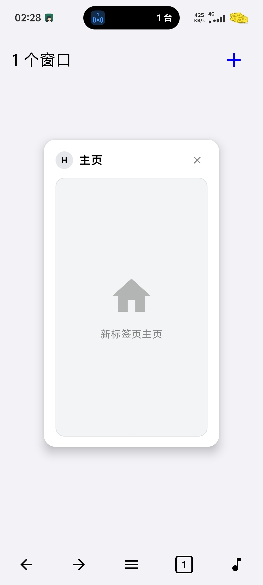
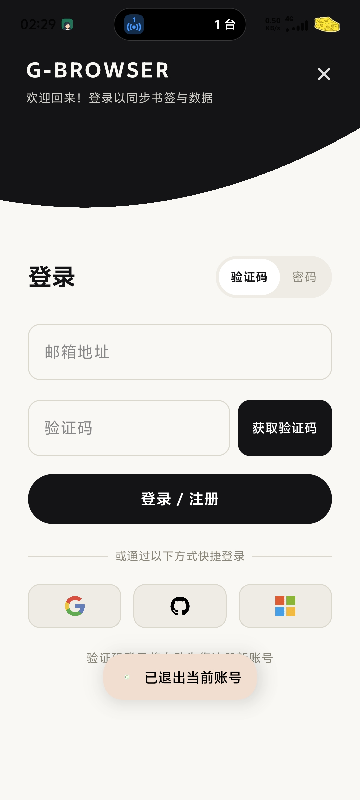
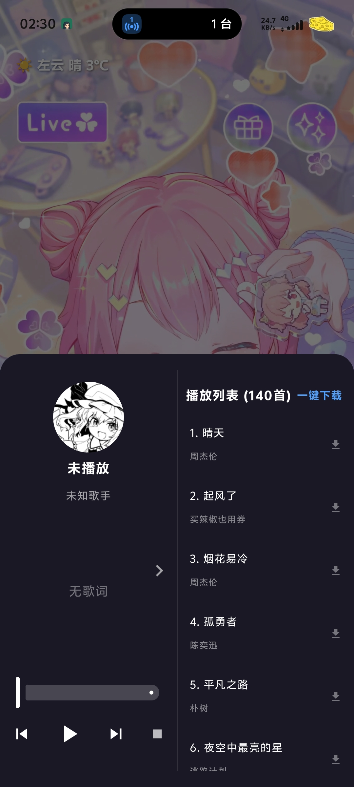

# 🚀 G-Browser (G浏览器) - 极简高颜值多功能个性化浏览器与音乐播放器

  

  <b>一款基于 Android Jetpack Compose 打造的极简、轻量、高可定制化现代浏览器与多媒体中心</b>

  
  
  
  
  

---
## 📱 应用界面展示 (Screenshots)
> 💡 *所有界面截图均为移动端竖屏实机效果，一目了然：*
| 🌤️ 主页与天气动态壁纸 | 📑 多标签页卡片管理 | ☁️ 云端账号与无缝转场 | 🎵 音乐播放器与双语歌词 |
| :---: | :---: | :---: | :---: |
|  |  |  |  |
---
## 🌟 核心功能全览
### 1. 🌐 现代智能双模浏览器
* **多标签页卡片式管理**：提供类似于移动操作系统的卡片式标签管理（Tab Overview）界面，支持快速新建、一键全部关闭、滑动删除标签，各标签页相互隔离独立的 WebView 实例，保证多任务浏览的稳定性与隐私性。
* **四大主流引擎极速切换**：内置 **Baidu、Bing、Google、Sogou** 四大主流搜索引擎，点击输入框左侧图标即可一键无缝切换。
* **极速联想词建议**：基于搜索联想词接口，内置 **150ms 智能防抖（Debounce）过滤** 算法，有效减少冗余网络开销，键盘输入即刻流畅呈现联想结果。
* **Edge 级硬件加速深色模式 (ForceDark)**：区别于简单粗暴的 CSS 反色滤镜，应用采用系统级 ForceDark 硬件加速技术，仅针对刺眼的浅色背景进行深色反转，对网页中的图片、视频色彩不做扭曲失真，夜间浏览护眼舒适。
* **电脑版 / 手机版排版一键切换**：自由切换 User-Agent，快速在移动端视图和桌面版（Desktop Mode）网页排版之间平滑过渡。
* **Edge 风格长按链接上下文菜单**：长按网页链接即可呼出悬浮菜单，支持“在新标签页打开”、“后台打开”、“复制链接”、“复制文本”、“直接下载”与“系统调用分享”。
---
### 2. ☁️ 云端账号体系与多端同步 (Supabase Auth & Database)
* **双模极速鉴权**：
  * **邮箱验证码免密登录 (OTP / Magic Link)**：集成自定义 SMTP 高速发信通道，输入邮箱即可秒获 6 位动态验证码；
  * **账户密码登录**：支持传统密码注册与登录，并提供忘记密码一键重置功能；
  * **第三方账号扩展**：架构上无缝兼容 Google、GitHub、Microsoft / Azure 快捷社交登录。
* **云端书签秒级双向同步**：本地书签的新增、修改与删除操作自动秒级同步至 Supabase 云端 PostgreSQL 数据库；跨设备登录即可自动合并最新数据。
* **专属资料与个性化资产**：内置丰富艺术头像库，支持系统相册本地头像自定义裁切导入，支持一键生成随机专属中文昵称，多端同步识别。
* **智能降级容灾 DNS (SmartDns)**：针对国内复杂移动网络环境（如系统 Private DNS 阻断或抖动），底层 OkHttp 网络层内置 Cloudflare Anycast 智能降级直连解析，保障在任何弱网或 DNS 异常状态下云端登录与同步均能稳定触达。
